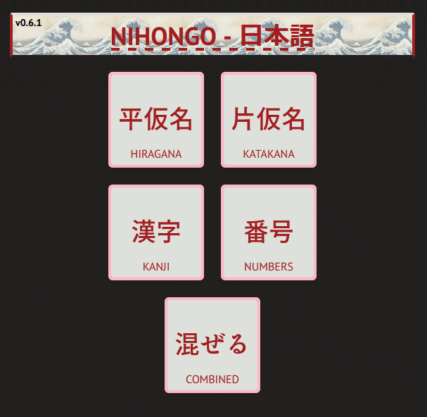
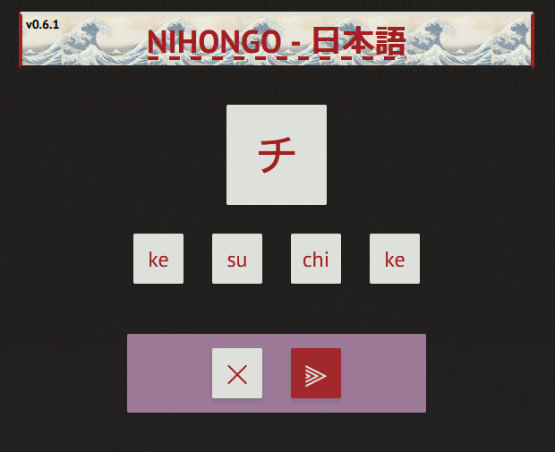
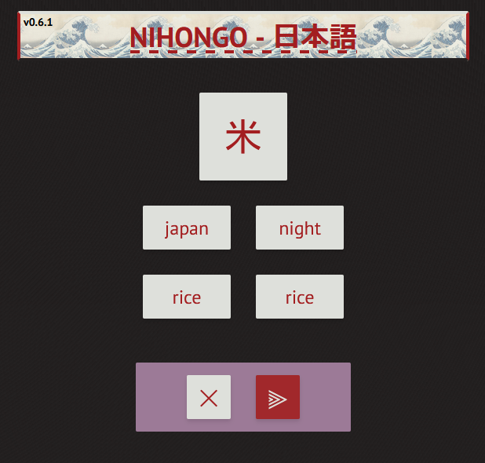

# NIHONGO - 日本語
## Training tool for learning the Japanese writing system
### Written in Elm with styling provided by TailwindCSS

## [LIVE VERSION](https://nihongo.karei.dev/)

## Gives you a random selection of 4 options to test your knowledge

